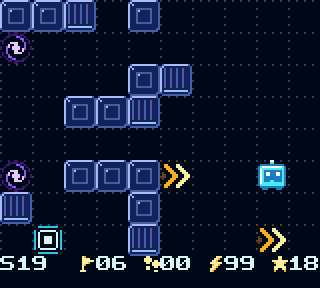
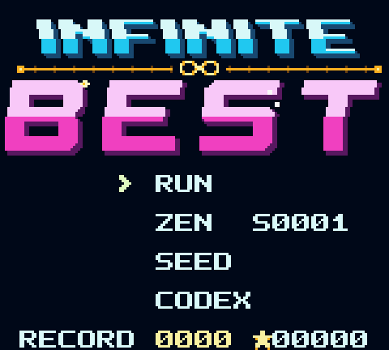
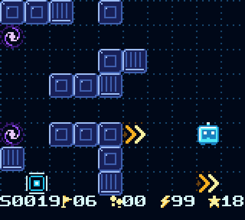
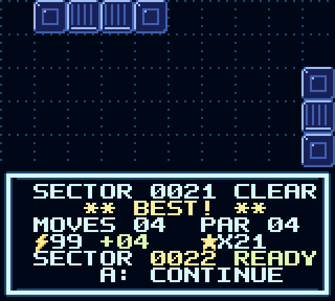
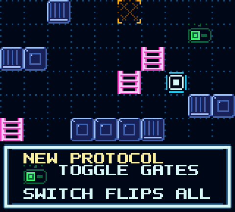
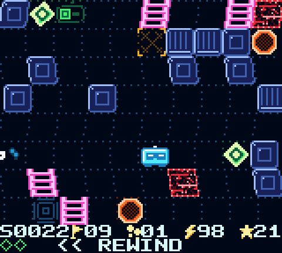
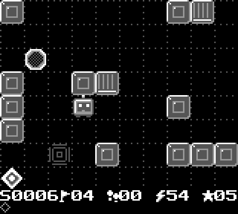
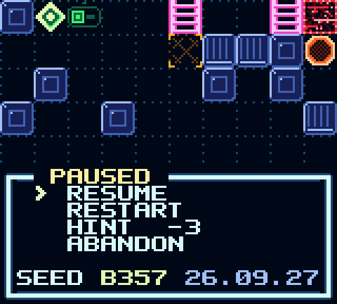
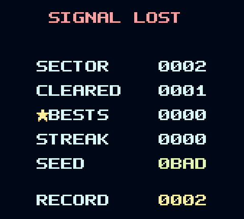

<h1 align="center">INFINITE BEST</h1>

<p align="center">
  <b>An endless, procedurally generated sliding puzzler for the Game Boy and Game Boy Color.</b><br>
  <i>One cartridge. No servers, no accounts, no ads. Always exactly one idea deep.</i>
</p>

<p align="center">
  
</p>

<p align="center">
  
  
  
</p>

---

You are a packet of data in a circuit. **You slide until something stops you.** Reach the exit.

Every sector has a **par**, the fewest possible moves. A real solver on the cartridge
computes it while the next level loads. **Match par and you get a BEST.** There's no last level.
The generator keeps inventing new sectors from a seed and teaching you new rules along the way.

The game is built for short sessions: a sector takes a minute or two, the next one is ready in
under a second, and the game saves after every clear. It aims to be thinky without wasting your time.

## What makes it tick

- **Wordless teaching.** Each new mechanic arrives on a sector designed around it, with a
  one-line label. The generator checks that the new idea actually matters: it strips the
  mechanic out, re-solves, and rejects the level if the par doesn't change. The sectors that
  follow keep asking the newest idea to matter, so it doesn't fade into decoration. *(After The Witness.)*
- **Rewind is free; time is not.** Hold **B** to rewind up to 256 moves back. The screen ripples
  and the music detunes. But your move counter and energy only go forward, so rewinding helps
  you understand the puzzle but can't earn you par. *(After Braid.)*
- **A roguelike you can put down.** RUN mode is a fresh seeded run where every move costs energy
  and every BEST pays you back. ZEN mode has no pressure and remembers where you are.
- **Seeds you can share.** Every run has a 4-digit hex seed. Type one in with **SEED** and play
  the exact same sectors as a friend or your kids, then compare BESTs.
- **Juice.** Screen shake that scales with slide distance, squash and stretch, motion trails,
  particle bursts, palette flashes, a glitch tear when you crash, an animated exit, and an
  original 4-channel chiptune soundtrack with 17 sound effects.

<p align="center">
  
  
  
</p>
<p align="center"><sub>A new mechanic arrives · the rewind ripple · the same game on a 1989 DMG</sub></p>

## Play it

- **On real hardware** (Game Boy, Pocket, Color, ModRetro Chromatic, Analogue Pocket…) with an
  **EverDrive**: download the `.gb` from **[Releases](../../releases/latest)** and follow
  **[docs/EVERDRIVE.md](docs/EVERDRIVE.md)**.
- **In an emulator**: open the `.gb` in SameBoy, mGBA, Gambatte, BGB or Emulicious.

The single release is always the latest build. Its tag is the build date (`YYYY.MM.DD`).

### Controls

| Button | Action |
| --- | --- |
| D-pad | Slide |
| **B** (hold) | Rewind, free, up to 256 moves back (energy already spent stays spent) |
| **SELECT** | Hint: the optimal next move and how many moves remain (costs 3 energy in RUN) |
| **START** | Pause: resume · restart · hint/skip · quit |

### Modes

| Mode | What it is |
| --- | --- |
| **RUN** | Roguelike. You start with 30 ⚡ and each move costs 1. A clear refunds its par, and a BEST adds +2 plus your streak. Reach zero and the run ends. Your furthest sector is the record. |
| **ZEN** | Endless and calm. No energy, free hints, skip any sector. Your sector is saved. |
| **SEED** | Start a RUN from a seed you type in (the pause and game-over screens show the current one). |
| **CODEX** | The rules, plus a field guide that fills in as you discover mechanics. |

### The rules, in the order you meet them

| From | Tile | Rule |
| ---: | --- | --- |
| 1 | Wall | Stops you. |
| 1 | Exit | Catches you as you slide over it, once it's online. |
| 3 | Stop pad | You stop *on* it. |
| 5 | Data chip | Collect every chip to bring the exit online. |
| 8 | Null pit | Slide in and you crash. The move is undone for free, but its energy is gone. |
| 11 | Router | Bends your slide. Two routers facing each other cause a `STACK OVERFLOW`. |
| 14 | Toggle gates | A switch flips which gate colour is solid, even mid-slide. |
| 18 | Portal | Warps you to its twin, keeping your momentum. |
| 22+ | Everything | Sectors mix 2-4 mechanics. Every 7th sector is a breather. |

<p align="center">
  
  
</p>

## Under the hood

The game is C, built with [GBDK-2020](https://github.com/gbdk-2020/gbdk-2020), with hand-written
SM83 assembly where speed matters. The cartridge is **MBC5 + RAM + battery**, 64 KB,
CGB-enhanced: colour and double speed on Color hardware, fully playable on an original DMG.

- **The generator** (`src/core/gen.c`) builds a candidate sector for *(seed, sector)* from the
  unlocked mechanics.
- **The solver** (`src/core/solver.c`) runs a breadth-first search over every reachable
  *(position × chips × switch)* state, at most 1280 of them, to find the exact par. Candidates
  outside the sector's difficulty window are rejected. A hand-built fallback means the game
  can never soft-lock.
- **Speed.** The slide inside the BFS is hand-written assembly over a wall-padded 12×10 grid,
  so it needs no bounds checks, multiplies or divides. It is about 10× faster than the
  compiler's version. A sector generates in ~0.3–1 s on a DMG and about half that on a Color, hidden
  behind the clear banner.
- **Determinism.** Everything is fixed-width integer maths on a 16-bit xorshift, so the Game Boy
  and a PC generate *byte-identical* sectors, and CI checks this.
- **Sound.** A custom 4-channel driver runs from VBlank. It has instruments, arpeggios, vibrato,
  glide, three wavetables, and sfx that borrow channels and give them back cleanly. The songs
  are written in a small tracker notation (`assets/music/songs.py`): *Title* (E minor
  synthwave), *Run A* (A minor), *Run B* (D Dorian), *Zen* (F Lydian music box) and a
  game-over sting.

More design notes: **[docs/DESIGN.md](docs/DESIGN.md)**.

```
src/core/     portable puzzle core: compiles with SDCC *and* gcc
  level.*       grid, rules, slide simulation (with event log for animation)
  solver.*      BFS solver + hints; SM83 asm hot loop, C reference on host
  gen.*         deterministic generator, difficulty curve, teaching sectors
  run.*         RUN/ZEN economy: energy, par grades, streaks
  rng.*         16-bit xorshift, identical everywhere
src/gb/       Game Boy front-end
  game.c        title, play loop, win / crash / game over, pause, codex, seeds  [banked]
  gfx.c         drawing, CGB palettes, shake / flash / wave FX, particles       [bank 0]
  sound.c       music + sfx engine, driven from VBlank                          [bank 0]
  music_data.c  generated songs and effects                                     [banked]
  assets.c      generated tiles, logo, palettes                                 [banked]
  save.c        battery-backed records and Zen progress
assets/       hand-editable ASCII-art tiles, palettes and music sources
tools/        gen_assets.py · gen_music.py · preview_assets.py · render_audio.py
              screenshots.py · ibgen.c (host CLI for the core)
tests/        host unit tests and emulator end-to-end tests
```

### Build

You need GBDK-2020 4.3 (at `/opt/gbdk`, or set `GBDK_HOME`), gcc, Python 3, and
`pip install pyboy pillow numpy` for the emulator tests.

```sh
make rom          # -> build/infinite-best.gb (+ .sym)
make test         # all of the below
make test-host    # C unit tests: rules, solver, generator, economy, sound engine
make test-assets  # asset pipeline tests
make test-rom     # boots the ROM in PyBoy (DMG + CGB) and plays it
python3 tools/screenshots.py   # regenerate the images in this README
```

`build/ibgen` puts the puzzle core on your command line:

```sh
build/ibgen show 42 30     # ASCII render of seed 42, sector 30
build/ibgen solve 42 30    # optimal solution, e.g. "9 DLLDLDLUR"
build/ibgen stats 100 100  # generator statistics over 10,000 sectors
```

### Tests

- **Core, ~28k assertions.**
  - Every rule and edge case: slides, chips, stop pads, pits, router loops, gates flipping
    mid-slide, portals, unsolvable boards, hints.
  - About 1,500 generated sectors, each replayed along the solver's hint chain and required to
    finish in exactly `par` moves.
  - Determinism, teaching sectors, the difficulty curve, the energy economy, and the RNG's full
    65,535 period.
- **Sound, 570 assertions.** Plays every song and effect against a fake APU and checks the
  register writes. Also covers channel ownership, loops, rewind and muffle, plus a random stress
  test.
- **Assets.** Encoding, counts, palette invariants, and that the generated sources are up to date.
- **ROM, in PyBoy on both DMG and CGB.**
  - Boots to the title.
  - Checks that the sector the **Game Boy** generates matches the host's byte for byte, which
    validates the assembly against the C reference.
  - Plays 20 sectors (every mechanic) using the host's optimal solutions and checks that every
    clear is a BEST.
  - Tests rewind (state restored, energy not refunded), pause/restart, seed entry, running out
    of energy, the game-over screen and the codex.

### CI and releases

[GitHub Actions](.github/workflows/ci.yml) installs GBDK, runs every test, and uploads the ROM
plus emulator screenshots as artifacts. When a push to the default branch passes, it
publishes a release **tagged with the date** and **deletes every older release**, so there is
only ever one: the latest.

## License

MIT, see [LICENSE](LICENSE).
